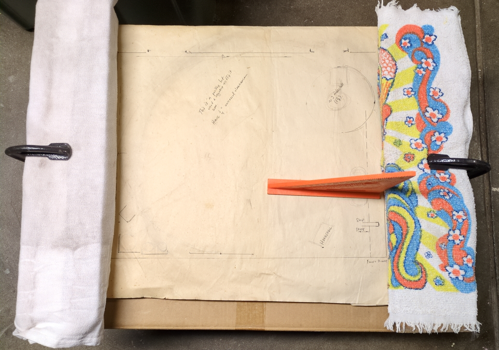
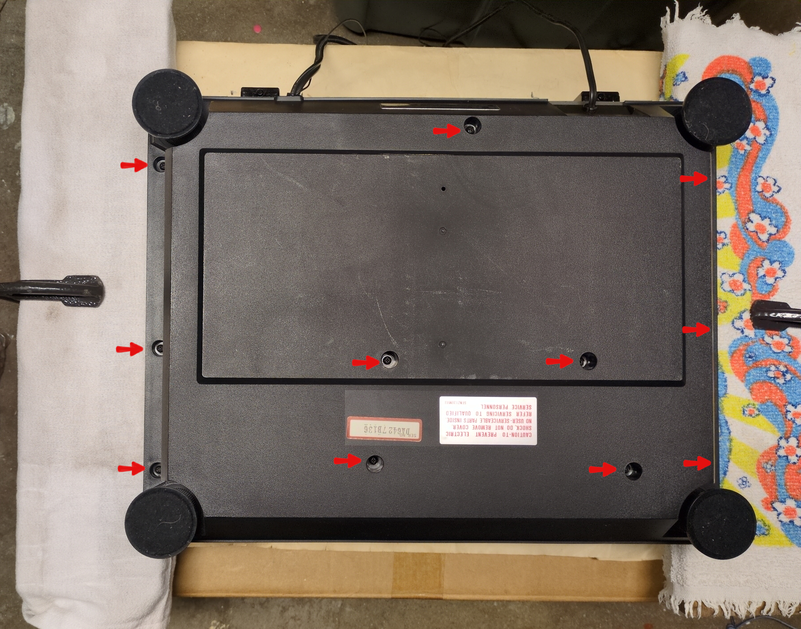
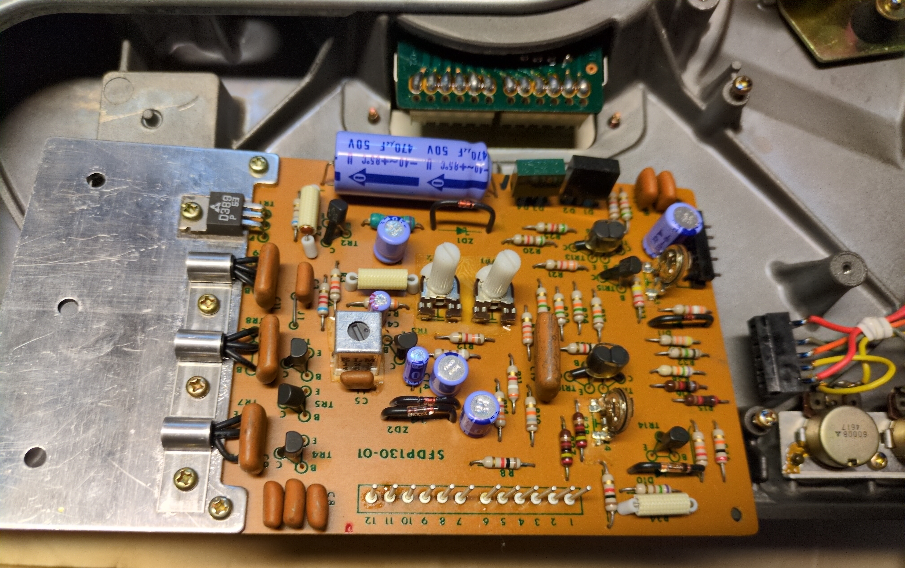
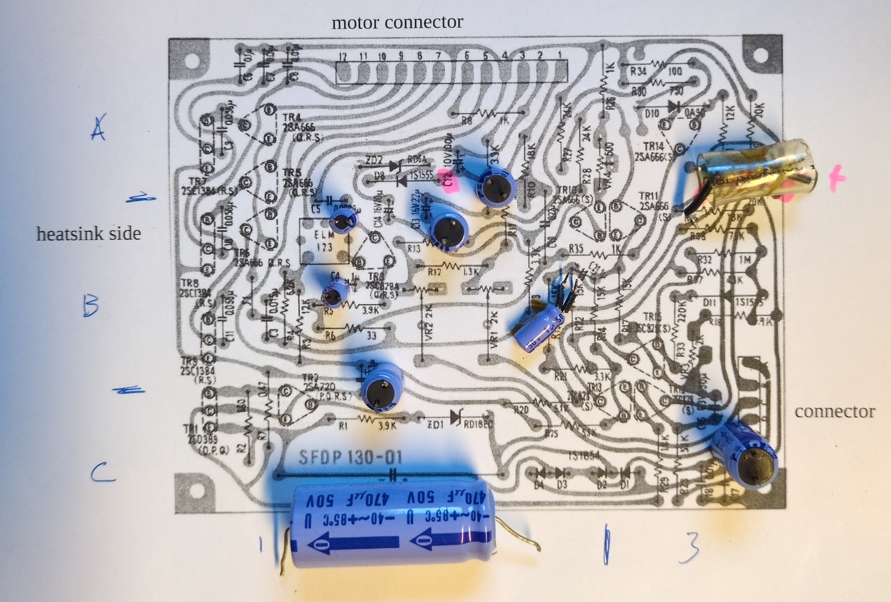
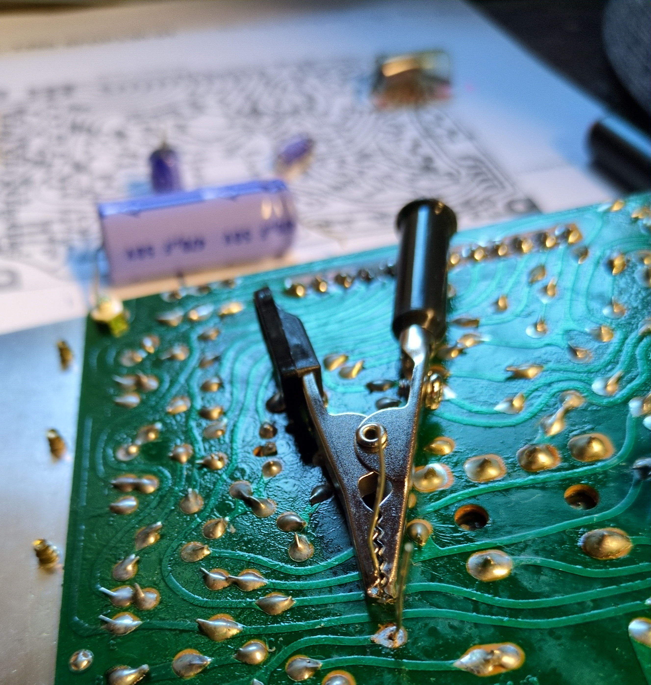
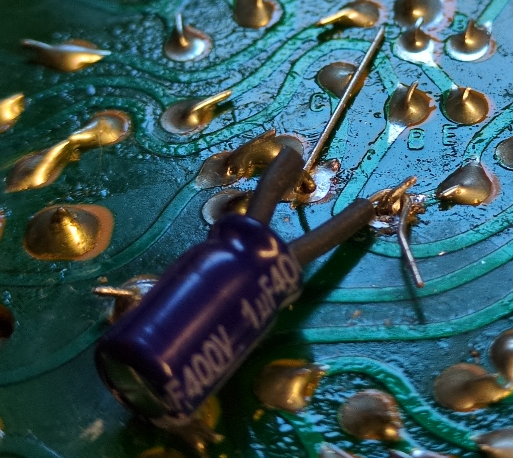

# Technics SL-1350 Rebuild
Consolidated documentation of a Technics SL-1350 turntable rebuild.  This is a non-code project focused on documentation, methods, tools, and parts needed to revitalize a Technics SL-1350. Some content points to prior rebuild of a [Sansui AU-717](https://github.com/Crumbs350/Sansui-AU-717-Rebuild). Documentation generated during my journey to rebuild this classic turntable with the help of the Audiokarma.org community and broader web resources. [Audiokarma thread](https://audiokarma.org/forums/index.php?threads/technics-sl-1350-rebuild-thread.1076778/)

# Repository Index

File | Description
---- | -----------
README.md | this file; contains references and general overview guide
parts_bom/audio.turntable.technics_sl-1350.parts_list.ods | bill of materials and tracking of parts replaced, see [BOM](#bill-of-materials) below for more context
parts_replaced_readme.md | explains [parts_bom/audio.turntable.technics_sl-1350.parts_list.ods](parts_bom/audio.turntable.technics_sl-1350.parts_list.ods) worksheets
parts.md | general information about electrical parts (non-exhaustive) focused on audio quality
howto_general.md | <li>covers soldering, desoldering tips and issues.</li><li>Covers transistor replacement matching methods</li>
license.txt | legal stuff, rules for sharing

# Rebuild General Information

## Preparation for Success
* Read and understand what you are doing before you start
* Document the process
  * Take pictures
    * of board number and multiple angles before disassembly
    * during disassembly with labels to help you understand orientation later
  * draw diagrams of screw locations and parts disassembled
  * use tape loops on paper to capture screws in an orientation similar to where they were originally, with diagrams or notes on the paper
  * attached labels to removed parts
  * mark wire colors on diagrams, and label wires if possible to get them confused with other connections
* Always use a dim bulb tester after each repair when applying power the first time
  * restricts current for short to ground
  * bulb wired in series to unit power
  * if bulb shines bright you have a short, if it dims over time you don't
  * Note: this may not work with non-incandescent (read non-resistive load) bulbs
  * References: 
    * [overview](https://antiqueradio.org/dimbulb.htm)
    * [instructable](https://www.instructables.com/Vintage-Dim-Bulb-Tester/)
    * [bulb wattage](https://audiokarma.org/forums/index.php?threads/dim-bulb-tester-what-watt-bulb.330103/)

## What you need for the job

The number of tools an things scales/changes with how much you replace or change. I reused list from prior Sansui rebuild that was much more complex.

### Replacement Parts and a Plan
* [See below for plan](#Technics-SL-1350-Rebuild-Plans-and-Online-Guides)
* [Parts list used](parts_replaced_readme.md)
* source of the parts list outlined in [Bill of Materials](#bill-of-materials) section below

### Tools
* wrap all but the tip of a small screwdriver with electrical tape to use to adjust potentiometers
* [dim build tester](https://antiqueradio.org/dimbulb.htm) to test for shorts after work
* cut credit card = PCB safe scrapper
* gloves
* fan - use to extract/disperse fumes
* soldering iron
* solder sucker and/or copper mesh
* brass ball to clean solder tip
* good lighting and jewelers headset to review solder joints
* [ESR meter to test capacitors](https://www.yamanelectronics.com/test-capacitor-without-desoldering/)
  * capacitance meter: replace if capacitance value < 10% below provided tolerance value
  * old capacitor capacitance value tends to decrease because the capacitor dries out with time, but its internal resistance value increases
  * ideal capacitor has an ESR value equal to zero, high ESR = sign of failure
  * [ref how to with table](https://www.youtube.com/watch?v=TowtpWVyPxM)
    * Signstek MESR-100 V2 suggested by videos (not an endorsement, just noting research)
    * [review](https://www.youtube.com/watch?v=o9uze0hitxc) liked better than DROK tester
  * https://www.electronicshub.org/best-esr-meter/
  * DIY: https://www.electronicdesign.com/technologies/power/article/21199428/a-simple-method-for-a-capacitors-esr-measurement
  * [look up table](https://techcircuit.org/esr-lookup-table-cheat-sheet/)
  * [look up table at Digikey](https://media.digikey.com/pdf/Data%20Sheets/Peak%20PDFs/ESR70%20Look-up%20Chart_Web.pdf)

### Chemicals/Materials
* water
* isopropyl alcohol
* non-acetone nail polish remover = ethyl acetate for glue removal
* thermal paste
* cotton balls
* small fuel line to replace tubing on leads of vibration susceptible parts
* heat shrink
* aluminum foil and cardboard scraps to protect heat sensitive parts
* solder
* solder flux

# Technics SL-1350 Rebuild Plans and Online Guides
## Model Reference
1. [Model differences](https://www.vinylengine.com/turntable_forum/viewtopic.php?t=12265)
  * Consider docs for SL-1300, SL-1310, SL-1350, SL-1500, SL-1510 are similar for some things

  | model | description |
  ---- | ----
  SL-1200 | can be considered the 'top of the range' of the mk2 domestic turntables
  SL-1300 | was fully auto, not MK2 circuit is IC based
  SL-1400 | semi-auto
  SL-1500 | manual
  SL-1600 | full auto
  SL-1700 | semi-auto
  SL-1800 | manual

## References
What others did to repair or service their turntable.

1. [XRayTonyB SL-1300 Service](https://www.youtube.com/watch?v=hi6cytq3AlE)
  * flip to service
    * do not flip turntable onto dust cover to service, it will break
    * remove dust cover
    * remove cartridge (just because)
    * remove rotating platter, pull up
    * flip onto support on the side that do not
    * he takes apart the potentiometers to clean 
       * using CRC safe cleaner
       * wipe then apply fader grease DFG-213 using a lint free makeup brush
       * he does this because argues that DeOxit makes them too loose in this application
       * DeOXit F100L fader lube for fiber board etc
    * he reflows the connectors from the board to the motor
    * ESR meter check capacitors
  * **do NOT power on direct drive turntable with platter removed**, the platter is the rotor part of the motor
  * the PCB is soldered to the motor stator coil
  * reassembly
    * put fine machine oil few drop in the center while the platter is off 
  * power on
    * always remove the arm hold and raise the lever for a auto turn table when powering on
  * he shows how to adjust the arm and catridge
  
2. [General Direct Drive Rebuild Guide](https://www.ifixit.com/Guide/%22Re-cap%22+and+Electrically+Overhaul+a+Direct+Drive+Turntable/141059)

3. [SL-1300 Service Thread](https://audiokarma.org/forums/index.php?threads/technics-sl-1300-rebuild-info.880964/)
  * Unplug, lock tonearm, remove mat and platter.
  * how to support upside down: 10x6x6 carboard box with a hole punched in the middle to stick the spindle into and flip over, keeps the tonarm clear of issues.
  * clean pots with Caig Deoxit G5
    * Clean them with the G5, squirt inside, spin full tilt, end to end 15-20 times
    * two coarse potentiometers for speed adjustment halfway between spindle and front of table.  Leave them positioned roughly at center position.
    * two "fine" potentiometers for 33/45 RPM, next to each other, right up front near the corner, held in by a single screw. I prefer to remove the screw and pop off knobs (if necessary) to gain better access to the pots.
    * repeat the process with the speed selector box, right next to them. If memory serves, two screws to remove if you go that route. After G5, flip switch dozen or two times.
  * clean off and regrease
    * clean off existing grease with rubbing alcohol
    * use plastic safe grease on paper towel to reapply
    * what: any greased plastic gears related to the tonearm and playing functions
    * what not: I don't bother with buried tonearm gearing unless the table had issues with the tonearm sticking on raise/lower.
  * 2 small drops of favorite light machine oil between gold brass shaft and the metal it goes into; he uses marvel mystery oil not KAB USA Technics Oil
    * not between the spindle and gold/brass shaft it goes into, but the gold/brass shaft and the metal it goes into
  * Reinstall platter. Fire up the turntable and run it for 2-3 minutes to distribute the oil. 
  * While at it, test the pitch controls to see if you're remotely close to being able to lock. See if you can lock 33 or 45 using the 'fine" speed pots. If yes, great.
    * I prefer to center the "fine" 33/45 pots, then adjust the coarse pots until locked as close to center on the "fine" pots as possible.
    * basically equates removing and reinstalling the platter constantly to adjust the "coarse" pots by a half-clock position CW/CCW (12:30 or 11:30, 1:00 or 11:00 etc) until I am locked dead-on with the "fine" 33/45 pots (or close to it). Plenty of room to grow down the road, although you won't need it, that turntable is rock solid.

4. [Dust Cover Restoration](https://audiokarma.org/forums/index.php?threads/restoring-a-dust-cover-for-an-sl1200.1076740/)
  * [points to SmileyFaceEQ](https://audiokarma.org/forums/index.php?threads/removing-scratches-from-dust-cover.1050632/) thread using turtle headlight polish, Novus #2 fine scratch remover, Meguiers Plastx
  * Wet sanding through 3000, mothers ultimate compound, scratch x2.0, mothers polish all on the appropriate pads followed by a hand buff with a very high quality microfiber or flannel cloth to apply a coat of wax to give it a deep shine.
  * SmileyFaceEQ - This is my polishing station. Aka my laundry room (Canada -40C the wife takes pity on me and lets me work inside rather than the detached garage) and my wet sanding and polishing rig. It is super high- tech: Rubbermaid lid to catch soap water residue a foam insulation pannel to keep the lid from wandering during the sanding and polishing stage and a thick piece of Styrofoam to help support the lid in the middle. I use it 2 or 3 times a week
    * [Example](https://audiokarma.org/forums/index.php?threads/started-a-side-hustle-polishing-turntable-lids.1054268/)
    * Start at an appropriate grit of wet dry and work up to 3000. 
        * Sand paper can be cleaned and reused several times.
        * 800 through 3000. 
    * Then compound, 2.0, polish and wax. 
    * Buff with ultra soft microfiber and get an antistatic gun to kill the static when finished.
    * I have used all kinds of brands and styles of compounds / kits, but the Mothers is the best results / value and accessibility.
    * [Hide Crack](https://audiokarma.org/forums/index.php?threads/started-a-side-hustle-polishing-turntable-lids.1054268/post-16984025) large crack on the front. Fused it with baking soda and superglue. Wet sanded and camouflage the repair with wood grain vinyl wrap.)
    * [Example](https://audiokarma.org/forums/index.php?threads/a-few-turntables-i-did-this-winter.907142/)
    * 

  * [ZenArrow Step by Step](https://audiokarma.org/forums/index.php?threads/a-step-by-step-dust-cover-renewal-easy-pics.793356/)
 
## Manuals and Specifications References
Because vinylengine SL-1350 source was not available, used [related model SL-1300 and SL-1600](###Model-Reference) manuals from Elektrotanya.
**local manual links**
* [SL-1300 User manual](manuals/audio.turntable.technics.sl-1300.manual.user.pdf)
* SL-1300 Service manual: 
   * [SL-1300](manuals/audio.turntable.technics.sl-1300.manual.service.pdf) - includes theory of operation!
   * [1300 MK2](manuals/audio.turntable.technics.sl-1300mk2_se.manual.service) - includes directions for how to remove cabinet bottom and cover
* [SL-1300/SL-1350 service manual - BOM](manuals/audio.turntable.technics.sl-1300mk2_se.manual.service.pdf) from AudioKarma
* SL-1350 manuals
   * [SL-1350 Operating Instructions = Service Setup Manual](manuals/audio.turntable.technics.sl-1350.manual.user.ve_technics_sl-1350.pdf) from VinylEngine
   * [SL-1350 Service Manual](manuals/audio.turntable.technics.sl-1350.manual.service.ve_technics_sl-1350_service_m_mc_en.pdf)
      * Schematic, Circuit Board, Adjustments, Exploded Part View and Parts List
   * [SL-1350 Service Manual Supplement](audio.turntable.technics.sl-1350.manual.service.ve_technics_sl-1300_1310_1350_1500_1510_service_sup)
      * Schematic, Circuit Board
      * Circuit Parts List
      * Test Signal Points
* [SL-1600 User manual](manuals/audio.turntable.technics.sl-1600.manual.user.pdf)
* [SL-1600 Service manual](manuals/audio.turntable.technics.sl-1600.manual.service.pdf)

**source links**
* [https://elektrotanya.com](https://elektrotanya.com)
   * [SL-1300 search](https://elektrotanya.com/showresult?what=technics+sl-1300&kategoria=Audio&kat2=All)
   * [SL-1600 search](https://elektrotanya.com/showresult?what=technics+sl-1300&kategoria=Audio&kat2=All)
   * [Technics SL-1300 Service Manual](https://elektrotanya.com/technics_sl-1300_sm.pdf/download.html)
   * can only download 5 files free per day
* [http://www.vinylengine.com](http://www.vinylengine.com)
  * a good source for user and service manuals if you already have an account.
  * New user accounts are not allowed and many webposts point to the admin as unaccessible

## Lubrication
Technics turntable oil part number SFWO 010
* [Amazon Technics Store Link](https://www.amazon.com/technics-sfw0010-center-spindle-panasonic/dp/b00n3os3py)
* above link notes says: Concern about the cost: KAB USA sells the very same vial for USD 6. see [https://www.kabusa.com/frameset.htm?/](https://www.kabusa.com/frameset.htm?/)

## Rebuild Plan Parts Suggestions
* Upgrade original polyester film capacitors to polypropylene film types (as appropriate ie in signal path). A turntable is mostly power control for the motor, unclear (unlikely) if this matters
* Capacitor selection general (Ref LeeStereo, see Sansui rebuild)
  * type of capacitor, (i.e., polar, bi-polar, film), is more relevant than the actual brand/series provided that the capacitors are from reputable manufacturers, e.g., Nichicon, Panasonic, UCC, CDE, Kemet, WIMA...etc… post #197
  * all film-type capacitors are bi-polar/non-polar by design choose 5% or less
  * For low ESR types, I typically use capacitors (from 20150422 Sansui Ref):
    * Panasonic (FM and FR series),
    * Nichicon (PW series) and
    * United Chemi-con (KZE, KYA, and KYB series)
  * For signal path duties, I typically use (from 20150422 Sansui Ref):
    * larger electrolytic capacitors: Nichicon ES bi-polar types to replace 
    * for smaller sizes (e.g., <4.7µF) I will use Panasonic or WIMA stacked film types
    * For C0G capacitors, I will typically use AVX brand, rated at 100V. All of the components used in this thread are available from Mouser.
  * voltage rating: As a general rule, the signal path capacitors will be subjected to lower voltages than the power supply capacitors. The polyester stacked film capacitors are typically available rated at 50V or 63V. For the polypropylene capacitors, use the smallest capacitor that will fit the available board space (which is often the lowest voltage rating). For C0G capacitors you can use 50V or 100V rated ones.
  * 2X-3X increase is acceptable for most small capacity capacitors whose purpose is solely DC filtering
  * Page 52 is the picture of all replaced capacitors


### Bill of Materials
Bill of materials (BOM) comes from SL-1300 and SL-1350 parts lists. Originally did not have access to SL-1350 because VinylEngine account access process is dumb. I pulled from the generic service supplement:  audio.turntable.technics.sl-1350.manual.service.ve_technics_sl-1300_1310_1350_1500_1510_service_sup.pdf

The BOM I used and tracking of the parts I replaced is in file [parts_bom/audio.turntable.technics_sl-1350.parts_list](parts_bom/audio.turntable.technics_sl-1350.parts_list) with [parts_replaced_readme.md](parts_replaced_readme.md) serving as a descriptive readme of each worksheet.

## generating BOM from documentation pdf images
1. Used pdfseparate to pull the individual pages
    `pdfseparate -f 3 -l 4 audio.turntable.technics.sl-1350.manual.service.ve_technics_sl-1300_1310_1350_1500_1510_service_sup.pdf audio.turntable.technics.sl-1350.manual.service.ve_technics_sl-1300_1310_1350_1500_1510_service_sup.%d.pdf`
2. tesseract-ocr to pull the text from the image
    `tesseract audio.turntable.technics.sl-1350.manual.service.ve_technics_sl-1300_1310_1350_1500_1510_service_sup.3.pdf audio.turntable.technics.sl-1350.manual.service.ve_technics_sl-1300_1310_1350_1500_1510_service_sup.3.txt --dpi 150`
3. convert to separate pngs, must shift pages for reasons unknown
    ```
    pdfimages -f 2 -l 3 -png audio.turntable.technics..sl-1350.manual.service.ve_technics_sl-1300_1310_1350_1500_1510_service_sup.pdf service_sup
    tesseract service_sup-000.png service_sup_000 --dpi 150
    tesseract service_sup-001.png service_sup_001 --dpi 150
    ```
4. clean up file as a csv and import

### Transistor Swap Threads
See BOM as necessary.

### Other Modifications
Not Applicable

## How To
Consolidation of specific how tos representative in whole (or part) of what I did, based on specific references as mentioned below.

### What I Actually Did
* Mostly followed XRayTonyB SL-1300 Service Referenced above.
* I replaced all the electrolytic capacitors.
* Replaced resistor R40 serial connected to C20 glued and connected inside PVC
* Cleaned off the glue: mostly lightly scrapped because non-acetone nail polish remover did not soften much, maybe because it is very cold outside today.
* used deoxit on the potentiometers
* Wiped down clear PVC with alcohol to remove film
* Removed PVC from parts on circuit boards, then just in case lined the board below with electrical tape (likely unnecessary), so that the parts that are heating will stop causing the decaying PVC to off gas. The parts are not near anything that will short on the chassis as the bottom is plastic.
* Put electrical tape on metal frame above 1 tall replacement capacitor that would be near the metal frame

### How I Did It
1. prepare to flip 
   1. Remove dustcover
   2. Remove arm weight (required) and cartridge (just because not required)
   3. Lock the arm and to be sure could use bread ties to really lock in place
   4. Remove rotating platter if using support option 1 by pulling up (I taped down paper to provide extra magnetic material shield)
1. create support ... supporting upside down unit
   1. The manual says you can support on the dust cover, but it is both old and unobtainable now so much safer to not do that (others say it breaks)
   2. 2 options: create a wide support, or use a cardboard box
   3. option 1: wide support 
      1. This method requires removing the platter
      2. Make a negative of the dust cover on paper taped to a sturdy board. Scrap MDF works well.
      3. Clamp a stack of support boards wrapped in cloth within 1/4 inch of the left and right edge dust cover outline using a carpenters square to check (see image)
         1. you need about 2 inches to clear the arm
         2. used 2x4 and 1x5 or 6
         3. wrapping in cloth holds the boards together and protects the turntable base from scratches
      2. The boards will catch the turntable base but not hit switches, controls, etc. 
   4. option 2: box with hole for spindle
      1. this method may be less stable than method 1, I did not try it
      2. use a box about the size of the platter with a hole cut in
      3. the turntable sits on the platter so don't remove it
flip ... use box or 
1. Removed bottom
   1. to remove the bottom you must remove all the red arrow marked screws 
   2. the 5 long screws in the center
   3. 6 outer short screws
   4. the bottom cover just pops off after that
   5. you don't remove the feet cause they are mounted from the inside
1. The circuit board is not soldered in
   1. remove 3 screws remaining 
      1. note which holes because 1 hole in board is for a longer plastic bottom screw already removed
      2. put them partially back in after the board is removed to not lose them
   2. pull off lower right connector, it slides off
   3. gentle apply even pressure to pull board up away from motor connector near center of turntable
   4. the board is shown flipped over, below, you can see the long pins that connect to the motor connector 
1. change parts out by
   1. desoldering with copper braid, removing glue as necessary
   2. tracking +/- orientation and confirming matches schematic and board labels 
   3. checking part value
   4. putting new part back in, holding with alligator clips on leg not  immediately being soldered 
   5. or using tension of carefully bent leg to hold in place 
2. reinsert board, connecting power connector
3. flip turntable
4. reinstall platter if removed
5. power up using a dim bulb tester
6. reinstall arm weight, adjust
7. use test record to power on, adjust speed and evaluate operation
8. when reassembling the long bottom screws have a false bottom tight point
   1. use a flash light
   2. watch as you tighten the screw
   3. at false bottom point the screw will have significant horizontal motion if moved with screw driver
   4. tighten past the mobile point to real tight point but do NOT over-tighten

### Things to Consider

* Pay attention to vibration and heat sensitive part instructions
  * polystyrene film capacitors are solvent and heat sensitive (solder with a heat sink attached to the leads).
  * I used 2 mm heatshrink on the leads with aluminum foil wrap to distribute the heat during heat gun application, then slide 3 mm fuel hose over that so the capacitor has longer leads for soldering and is supported to avoid vibration. Also necessary because could only find axial part to replace the original

### Cleaning 

#### General Cleaning
* Super dirty cleaning advice from amplifier service: https://audiokarma.org/forums/index.php?threads/new-member-really-dirty-au-717-need-advice.514913/
* remove, clean, and give new thermal compound for transistors

#### Glue Removal
* https://audiokarma.org/forums/index.php?threads/my-solution-for-easy-au-717-sansui-glue-removal.508267/#post-6602302
* solvent: Can use acetone, isopropyl alcohol, ethyl acetate
  * concerns about acetone being agressive, see [LeeStereo 351](https://audiokarma.org/forums/index.php?threads/leestereos-restoration-upgrade-of-a-sansui-au-717.641945/page-18#post-13740628), it affects some plastics
  * I used ethyl acetate - less aggressive solvent
* spread cotton balls out on/around glue (tucked in good around components)
* Saturate with 1-2 cap fulls of solvent
* Wait 15-20 minutes.
* Scrape off
  * used an old (or postal trash) credit card as a scraper (cut down to fit smaller spaces)
  * flat exacto knife blade but metal can scar the board

#### Thermal Grease
* Clean old dried thermal grease with alcohol and a soft cloth
* Note I used a old credit card or razor blade to spread new compound

#### Control (Switch/Potentiometer) cleaning threads:
* What chemical?
  * I ended up just using DeOxit-F5 on potentiometers (can use on switches too)
  * **do not use Windex or WD40**
  * DeOxit-D5 vs DeOxit-F5
    * the core difference is F5 contains lubrication
    * when to use [public recommendation](https://audiokarma.org/forums/index.php?threads/speakers-cutting-in-and-out.967652/#post-15028481)
       * D5 for switches (metal / metal contacts)
       * F5 for potentiometers
    * Caig, DeOxit maker says F5 okay for some switches
  * DeOxit-D5
    * [ref](https://audiokarma.org/forums/index.php?threads/deoxit-d5.947097/#post-14504688)
    * skywatcher: But it is mainly for switches and not pots. I clean pots with D5, then use FaderLube (F5). He prefers CRC QD or MG Chemicals no-residue cleaners.  
* [Idiots Guide to Using DeOxit](https://audiokarma.org/forums/index.php?threads/the-idiots-guide-to-using-deoxit-revisited.207005/)
* Cleaning video: https://youtu.be/_3gSIeEzOZM 
* https://audiokarma.org/forums/index.php?threads/the-idiots-guide-to-using-deoxit-revisited.207005/
  * great thread with lots of info on disassembly and DeOxit use
  * DeOxit Red stuff clean
  * DeOxit ProLube or DeOxit GOLD, to lubricate and protect the switches. 
* clean/lubricate volume control:
  * [partial dissembly method](https://audiokarma.org/forums/index.php?threads/sansui-au-717-volume-control-pot-maitenence-help-please.43185/#post-594781)
  * [drill method (not recommended)](http://www.cdkands.com/AU717-7.html)
* Search Skywatcher #282 in [howto_reference_guide_notes.md](howto_reference_guide_notes.md) for suggestion on more extreme disassembly and cleaning using brush and water of parts

### Disassembly and Specific Actions

Preference is to work on the boards in situ whenever possible.
See what I did above.
